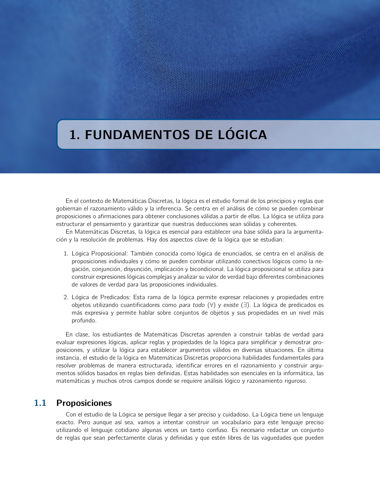
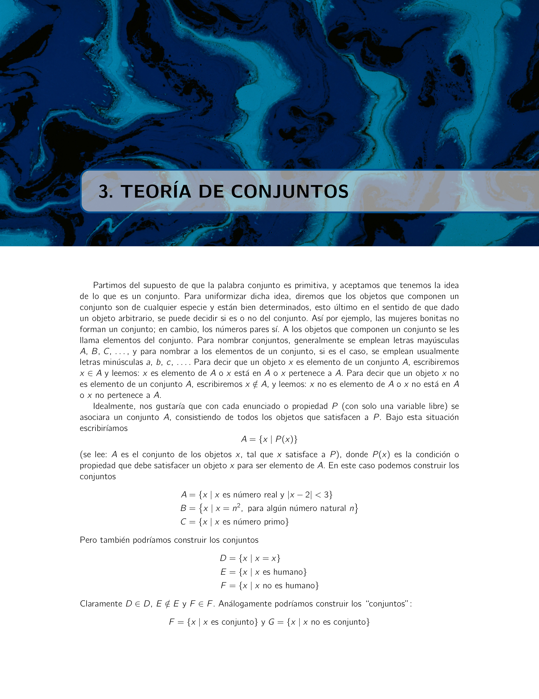
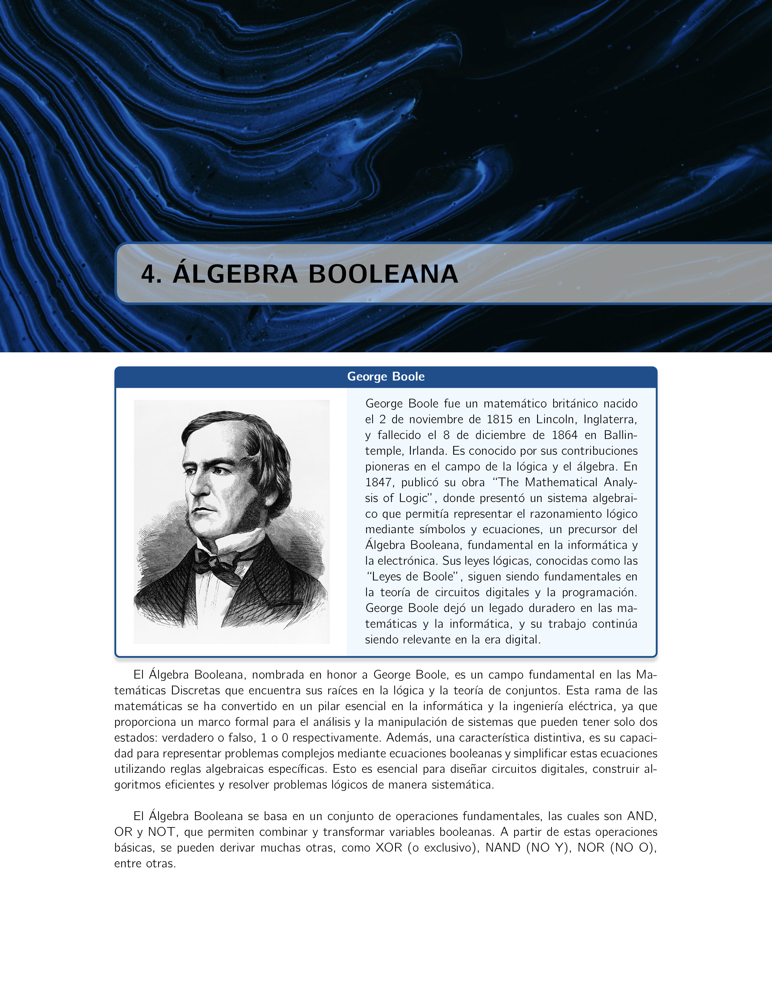
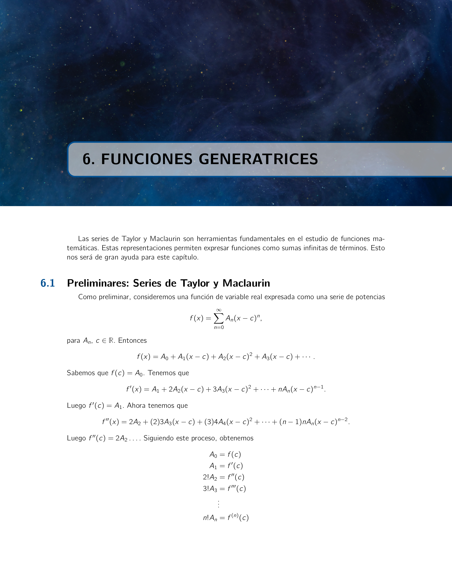
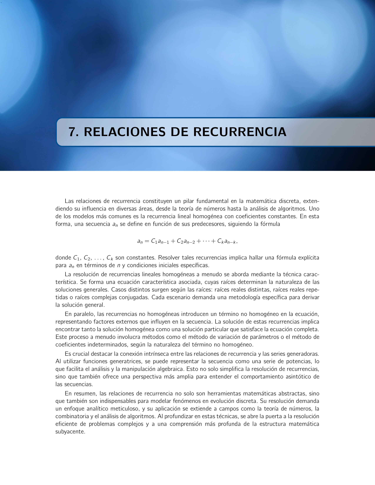

# Matemáticas Discretas

## Descripción
Este repositorio contiene notas y recursos del curso "Matemáticas Discretas" del Lic. Rubén Ramón Vargas Palomares, profesor en la Escuela Superior de Física y Matemáticas (ESFM), México. El documento es una guía integral sobre conceptos fundamentales y aplicaciones de las matemáticas discretas.

El contenido cubre diversos temas como lógica, técnicas de conteo, teoría de conjuntos, álgebra booleana, relaciones, funciones, funciones generatrices, relaciones de recurrencia y el principio de inclusión y exclusión.

## Tabla de Contenidos
1. **Fundamentos de la Matemática Discreta**
    - 1.1 Proposiciones
    - 1.2 Simbolización de proposiciones
    - 1.3 Términos de enlace o conectivos
    - 1.4 Tablas de verdad
    - 1.5 Reglas de inferencia
    - 1.6 Leyes de la lógica
2. **Técnicas de Conteo**
    - 2.1 Reglas de la suma y el producto
    - 2.2 Permutaciones
    - 2.3 Combinaciones: El teorema del binomio
    - 2.4 Combinaciones con repetición: Distribuciones
3. **Teoría de Conjuntos**
    - 3.1 Conjuntos y subconjuntos
    - 3.2 Operaciones entre conjuntos
    - 3.3 Leyes de la teoría de conjuntos
    - 3.4 Diagramas de Venn-Euler
4. **Álgebra Booleana**
    - 4.1 Funciones booleanas: Formas normales disyuntiva y conjuntiva
5. **Relaciones y Funciones**
    - 5.1 Productos cartesianos y relaciones
    - 5.2 Funciones: en general e inyectivas
    - 5.3 Funciones sobreyectivas
    - 5.4 Composición de funciones y funciones inversas
6. **Funciones Generatrices**
    - 6.1 Preliminares: Series de Taylor y Maclaurin
    - 6.2 Ejemplos introductorios
    - 6.3 Técnicas de cálculo
    - 6.4 Función generatriz exponencial
7. **Relaciones de Recurrencia**
    - 7.1 La relación de recurrencia lineal de primer orden
    - 7.2 La relación de recurrencia lineal homogénea de segundo orden
    - 7.3 La relación de recurrencia no homogénea
8. **El Principio de Inclusión y Exclusión**
    - 8.1 El principio de inclusión y exclusión
    - 8.2 Generalizaciones del principio

## Características
- **Definiciones y Ejemplos Matemáticos**: El documento incluye definiciones, ejercicios y ejemplos para los conceptos clave.
- **Ejercicios y Soluciones**: Se proporcionan numerosos ejercicios para practicar y fortalecer el entendimiento de cada tema.
- **Temas Suplementarios**: Incluye secciones adicionales sobre inducción matemática y el uso de la computadora en la resolución de problemas.

## Nota
Estas notas fueron de hace dos años, actualmente en 2025 estoy trabajando en la segunda edición.

## Cómo Usarlo
1. **Leer y Comprender**: Comienza con los capítulos fundamentales (Lógica, Técnicas de Conteo, Teoría de Conjuntos) para entender los conceptos básicos.
2. **Practicar con los Ejercicios**: Usa los ejercicios y ejemplos proporcionados para poner a prueba tu comprensión de los temas.
3. **Consultar la Bibliografía**: Al final del documento encontrarás una lista de referencias que puedes consultar para obtener más detalles sobre temas específicos.

## Contribuciones
Si tienes sugerencias para mejorar el contenido o encuentras errores en el documento, no dudes en abrir un issue o hacer un pull request. ¡Tus contribuciones son bienvenidas!

## Licencia
Este trabajo está en el dominio público. Puedes usar, distribuir y modificar el contenido según sea necesario. Se agradece la atribución, pero no es obligatoria.